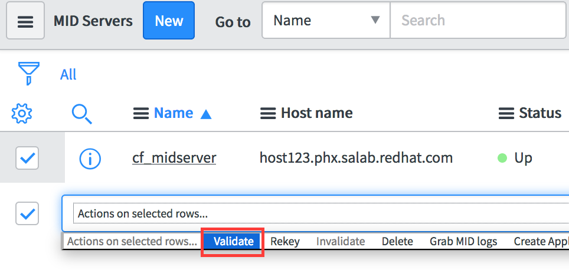

////
 midserver.adoc
-------------------------------------------------------------------------------
   Copyright 2016 Kevin Morey <kevin@redhat.com>

   Licensed under the Apache License, Version 2.0 (the "License");
   you may not use this file except in compliance with the License.
   You may obtain a copy of the License at

       http://www.apache.org/licenses/LICENSE-2.0

   Unless required by applicable law or agreed to in writing, software
   distributed under the License is distributed on an "AS IS" BASIS,
   WITHOUT WARRANTIES OR CONDITIONS OF ANY KIND, either express or implied.
   See the License for the specific language governing permissions and
   limitations under the License.
-------------------------------------------------------------------------------
////

link:https://github.com/ramrexx/ServiceNow_ServiceCatalog[ Home ]

= Install and Configure MID Server

The MID Server is a small application that runs in your environment. Its sole purpose is to execute REST calls on behalf of ServiceNow behind your firewall. It monitors ServiceNow's `ecc_queue` for tasks that it needs process. What does this mean? For ServiceNow to make REST calls to your Cloudforms appliance behind your firewall you will need a MID Server!

== Table of Contents

** <<Install MID Server>>
** <<Configure MID Server>>
** <<Start MID Server>>
** <<Validate MID Server>>
** <<Troubleshooting MID Server>>

=== Install MID Server

* Log into your ServiceNow instance
* Navigate to MID Server *Downloads* and download the appropriate (ZIP) package

image:images/snow-mid-server-download.png[link=images/snow-mid-server-download.png]

NOTE: You can run the MID server anywhere in your environment. For *testing* purposes only you may choose to download the Linux 64-bit package onto your CloudForms appliance. If you do use the `/opt` directory.

* Extract the ZIP into a directory.

<<top>>

=== Configure MID Server

* Open the /opt/agent/config.xml using your favorite editor.
* Make the following changes:

** `<parameter name="url" value="https://YOUR_INSTANCE.service-now.com"/>`
** `<parameter name="mid.instance.username" value="YOUR_INSTANCE_USER_NAME_HERE" />`
** `<parameter name="mid.instance.password" value="YOUR_INSTANCE_PASSWORD_HERE" encrypt="true"/>`
** `<parameter name="name" value="YOUR_MIDSERVER_NAME_GOES_HERE"/>`

NOTE: You must put the password in clear text. But don't worry it will encrypt the password as soon as you start the MID server.

* Start the MID Server service by running:

 /opt/agent/start.sh

<<top>>

=== Validate MID Server

* Log into your ServiceNow instance.
* Navigate to *MID Server* Servers
* By now you should see your MID Server instance but it has not been validated.
* Validate the MID Server

<<top>>

=== Start MID Server

TIP: Optionally you can set the MID Server Service to automatically start.

* Create a file called /etc/systemd/system/*mid.server* and copy the contents below to it.

[source, ini]
----

[Unit]
Description=ServiceNow MID Server
After=syslog.target
After=network.target

[Service]
PIDFile=/opt/agent/work/mid.pid

ExecStart=/opt/agent/bin/mid.sh start

[Install]
WantedBy=multi-user.target
----
* Configure the ServiceNow MID Server Service

 systemctl daemon-reload
 systemctl start mid
 systemctl enable mid

<<top>>

=== Troubleshooting MID Server

* Logging - If your MID Server is not showing up you can look at the /opt/servicenow/agent/logs/agent0.log.0.

* Validate - Ensure that your MID Server has been validated otherwise it will be to execute tasks coming from ServiceNow.

* Connectivity - If your MID Server requires a proxy to get to the ServiceNow instance you can specify proxy settings in `/opt/servicenow/agent/config.xml` under the *COMMON OPTIONAL* parameters section.

<<top>>

link:updateset.adoc[ Previous ] | link:restmessage.adoc[ Next ]
