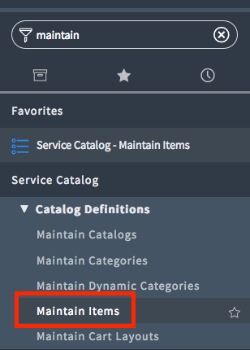
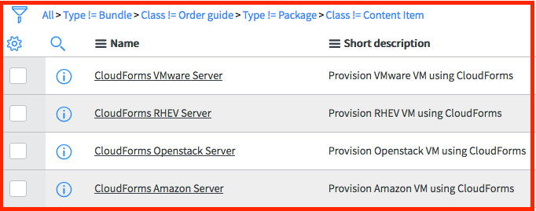
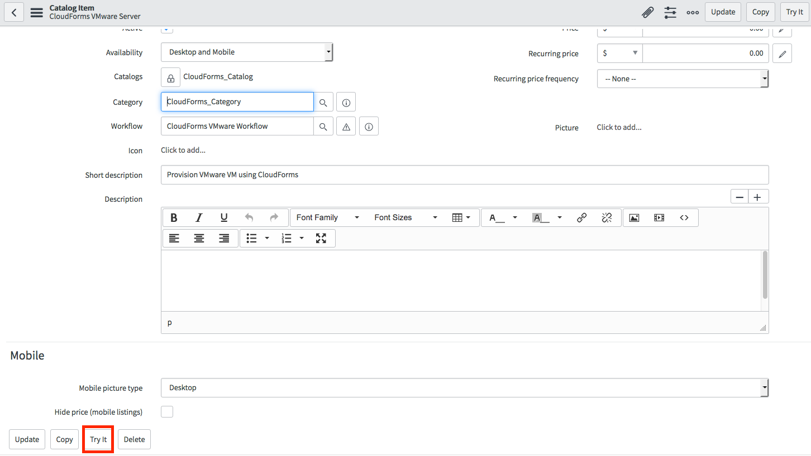
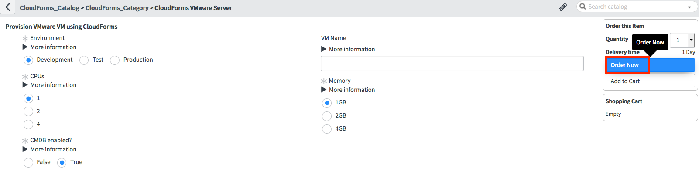
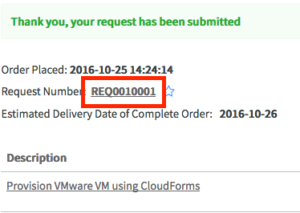
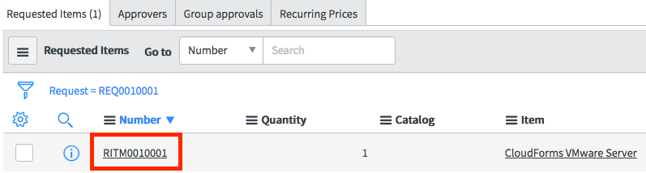
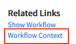
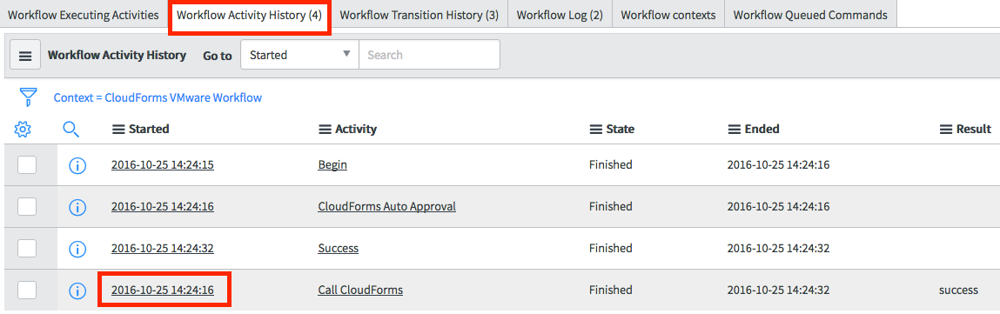
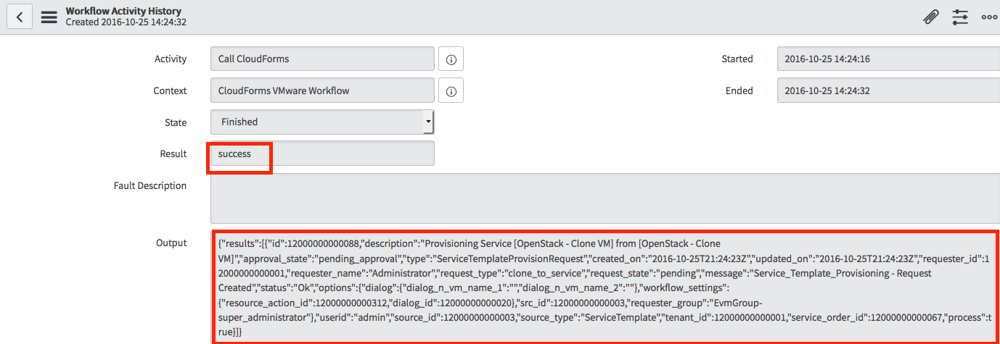

////
 provision.adoc
-------------------------------------------------------------------------------
   Copyright 2016 Kevin Morey <kevin@redhat.com>

   Licensed under the Apache License, Version 2.0 (the "License");
   you may not use this file except in compliance with the License.
   You may obtain a copy of the License at

       http://www.apache.org/licenses/LICENSE-2.0

   Unless required by applicable law or agreed to in writing, software
   distributed under the License is distributed on an "AS IS" BASIS,
   WITHOUT WARRANTIES OR CONDITIONS OF ANY KIND, either express or implied.
   See the License for the specific language governing permissions and
   limitations under the License.
-------------------------------------------------------------------------------
////

link:https://github.com/ramrexx/ServiceNow_ServiceCatalog[ Home ]

= Provision a Catalogitem
Leveraging the `CloudForms Application` update set you can quickly order your catalog item to deploy a VM to CloudForms.

== Table of Contents

** <<Choose Catalogitem>>
** <<Order Catalogitem>>
** <<View Request Details>>
** <<View Request Item Details>>
** <<View Request Item Activity Details>>

=== Choose Catalogitem

* Log into your ServiceNow instance.
* Navigate to *Maintain Items*

* Select one of the *pre-built* CloudForms catalog items that you would like to use.

<<top>>

=== Order Catalogitem

* Click on `Try it`

* When the dialog appears click on `Order Now`

<<top>>

=== View Request Details

* When presented the request summary, click on the `REQUEST` ID.

* At the bottom of the Request summary you can select your Request Item ID.

<<top>>

=== View Request Item Details

* Towards the bottom of the Request Item summary page select `Workflow Content`.

<<top>>

=== View Request Item Activity Details

* Choose the `Workflow Activity History` tab and select the DateTime stamp next to the `Call CloudForms` task.

* You should see the results of the API call.

<<top>>

* If you do not see the expected results, view the link:troubleshooting.adoc[ Troubleshooting Guide ].

link:restmessage.adoc[ Previous ]
