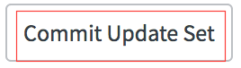
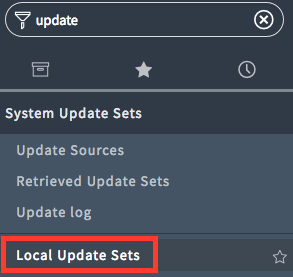
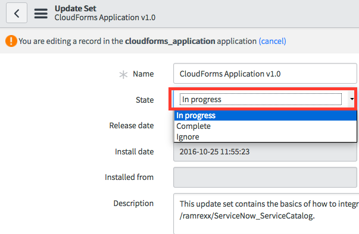
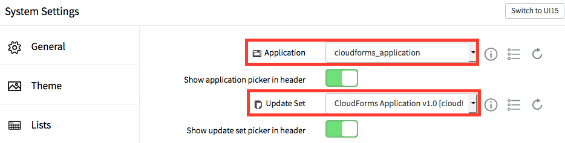

////
 updateset.adoc
-------------------------------------------------------------------------------
   Copyright 2016 Kevin Morey <kevin@redhat.com>

   Licensed under the Apache License, Version 2.0 (the "License");
   you may not use this file except in compliance with the License.
   You may obtain a copy of the License at

       http://www.apache.org/licenses/LICENSE-2.0

   Unless required by applicable law or agreed to in writing, software
   distributed under the License is distributed on an "AS IS" BASIS,
   WITHOUT WARRANTIES OR CONDITIONS OF ANY KIND, either express or implied.
   See the License for the specific language governing permissions and
   limitations under the License.
-------------------------------------------------------------------------------
////

link:https://github.com/ramrexx/ServiceNow_ServiceCatalog[ Home ]

= Install and Configure Update Set

The `CloudForms Application` update set contains sample catalogitems, variable sets, workflows and REST messages that allow ServiceNow to easily be integrated with CloudForms.

== Table of Contents

** <<Import Update Set>>
** <<Configure Update Set>>
** <<Configure System Settings>>

=== Import Update Set

* Download the repo to your desktop: link:https://github.com/ramrexx/ServiceNow_ServiceCatalog/archive/master.zip[ServiceNow CloudForms Application]
* Extract the repo ZIP and note the xml in the *update_set* directory.
* Log into your ServiceNow instance
* Navigate to *Update Sets* and click on *Import Update Set from XML*

image:images/snow-retrieve-update-set.png[link=images/snow-retrieve-update-set.png]

* Upload the *ServiceNow CloudForms Application.xml*
* Within the retrieved update set click on *Preview Update Set*

image:images/snow-preview-update-set.png[link=images/snow-preview-update-set.png]

* You may see a warning message during the preview. Believe it or not this is normal.

image:images/snow-preview-errors.png[link=images/snow-preview-errors.png]

* Select all of the errors and delete them.

image:images/snow-preview-delete.png[link=images/snow-preview-delete.png]

* After the delete is finished click on *Commit update set*

<<top>>

=== Configure Update Set

* Navigate to *Local Update Sets*

* Click on *CloudForms Application* and change the state to `in progress` and click `Update` to save your changes.

<<top>>

=== Configure System Settings

* Change your *application* and *update set* views by clicking on settings in the top right hand corner
* Within the *Developer* section make the following changes:
** Change the application to `cloudForms_application`.
** Change the update set to `CloudForms Application`.

NOTE: This way any changes that you make will be applied to the right application and update set.

<<top>>

link:../README.adoc[ Previous ] | link:midserver.adoc[ Next ]
